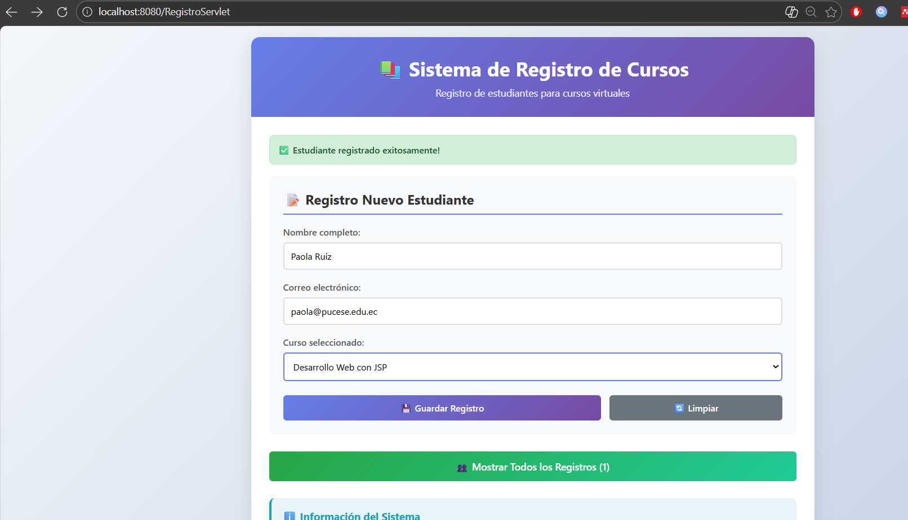
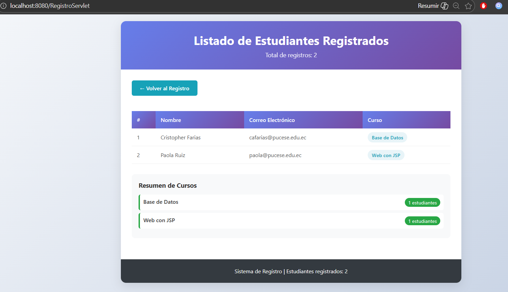
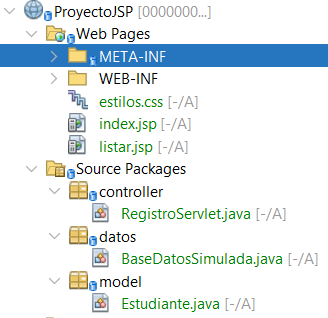

# Sistema de Registro de Estudiantes - JSP/Servlets

**Aplicación web completa para gestión de estudiantes en cursos virtuales**

##  Descripción

Sistema web desarrollado en **Java EE** utilizando **JSP** y **Servlets** que implementa un registro de estudiantes para cursos virtuales. Simula una base de datos en memoria usando `ArrayList`.

El sistema permite a los administradores registrar nuevos estudiantes, almacenar sus datos de contacto, asignarlos a cursos específicos. La aplicación está diseñada *, implementando el **patrón Modelo-Vista-Controlador (MVC)** para asegurar una clara separación de responsabilidades, facilitando el mantenimiento y la escalabilidad.

---
## Arquitectura

### Estructura del Proyecto

---

## Características

- ✅ **Formulario de registro** con validación
- ✅ **Listado dinámico** de estudiantes
- ✅ **Simulación de BD** en memoria
- ✅ **Patrón MVC** implementado
- ✅ **Diseño responsive** con CSS
- ✅ **Método POST** para envío seguro
- ✅ **Manejo de sesiones** HTTP

---

## Instalación

### **Requisitos**
- Java JDK 17 o superior
- Apache NetBeans 15+
- Apache Tomcat 
- Git (opcional)
